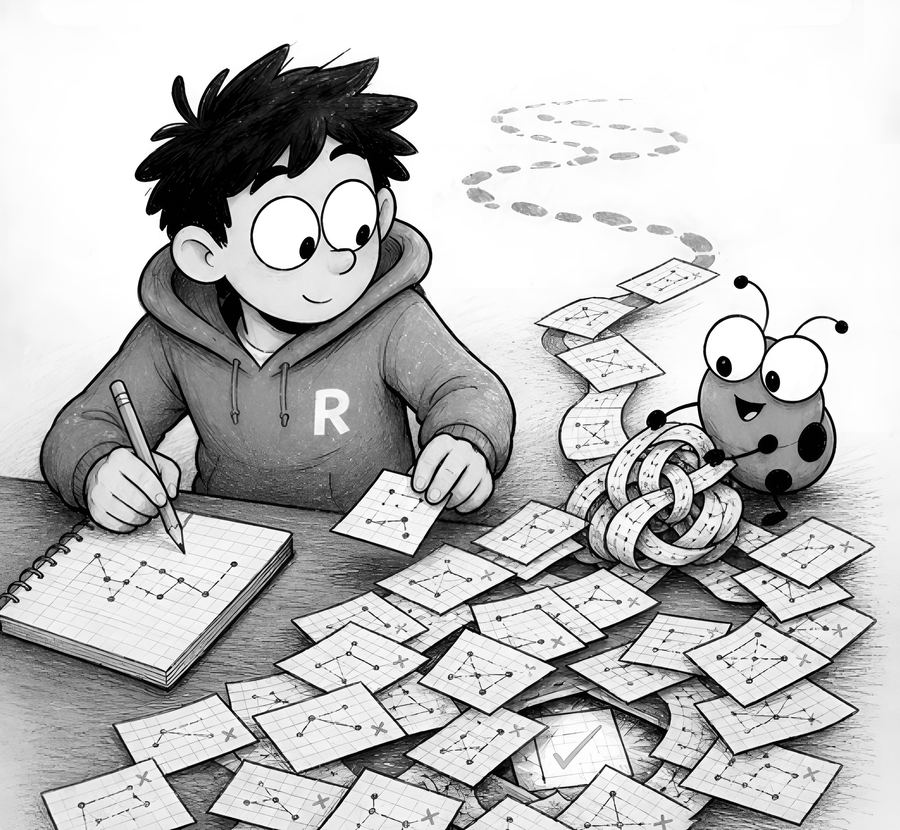

> **Free sample.** Chapter 2 of *Trust Issues: Working With Code You Didn’t Write* by Ayaan Ahmad, shared as an excerpt. © 2026 Ayaan Ahmad. All rights reserved. Not covered by this repo's MIT licence.

**CHAPTER 2**

# The 67/68 Problem

I told you how much I loved coding. Now let me tell you about the two days it made me question that love.

Two or three years ago, I was integrating with an API that shall remain nameless — partly to protect the guilty, partly because you’ve definitely met one just like it. This API had a communication style best described as *minimalist*. No error messages. No logs worth reading. Just HTTP status codes, and a dashboard that showed exactly one useful metric: failed requests over total requests.

It started at 1/1. Then 2/2. Then 13/13. Then 32/32. A perfect record — of failure. I was deep in debugging mode, changing things, re-sending, changing more things. The next time I looked at the dashboard, it read:

**67/68.**

One request had worked.

*Which one?*

I froze. Somewhere in the last hour of frantic edits, one combination of my changes had produced a success — and I had kept editing right past it. Does Ctrl+Z work on your entire project? Asking for a friend. (I guess that’s what git is for. The 2023 version of me was about to learn that lesson at full price.)

It took me **two days** to trace back which change had produced that single 200. Two days of manually reconstructing my own chaos, one edit at a time.

There’s a special kind of pain in *almost*. A clean 0/68 I could have made peace with — total failure is at least honest; you sigh, you rethink your approach, you move on. But 67/68 is the universe personally taunting you. Success wasn’t theoretical anymore. It had *happened* — on my machine, with my code, sometime in the last hour — and now it was hiding somewhere in my own edit history, fully aware of what it was doing to me. I remember physically leaning closer to the screen, as if the dashboard might whisper which request it was if I just looked sincere enough.

The cruelest part: I couldn’t even celebrate. Every engineer knows the rule — one success you can’t reproduce isn’t a success, it’s a fluke wearing a suit. Until I could make that 200 happen on purpose, it was worth exactly nothing. So close to done, and contractually obligated to pretend I wasn’t.

Here’s the uncomfortable truth about that story: nothing about the debugging required creativity. It required *repetition with memory* — try a variation, observe the result, record it, narrow down. I was a slow, tired, increasingly bitter for-loop with a caffeine dependency.

That is exactly the class of misery that’s now optional.

## Don’t chase the euphoria

When that request finally worked, the dopamine hit was unreal. I get it — that rush is why half of us are in this industry.

But as much as I loved that feeling, I won’t recommend you chase it. That euphoria is the reward for surviving a process that shouldn’t have required survival. If you’ve been around the industry, you know “prompt engineering” became a thing — a skill, a job title, a thousand LinkedIn posts. There’s something newer now, and I hope it stays relevant for a while because it’s genuinely cool: **loop engineering.**

## What a loop actually is

Prompt engineering is asking the machine really nicely, once, and hoping.

Loop engineering is different: instead of sitting there re-running the thing by hand until it works, you put an agent in charge of *making* it work — running a series of steps, checking the result, adjusting, and repeating — so you don’t have to sit there babysitting the terminal.

Your job moves upstream. You don’t write the fix; **you define what success looks like**, hand over the tools to check for it, and tell the agent to iterate until success is met. Until the agent sees that 200, it keeps looping — trying different things, reading the actual errors, narrowing down. Exactly what I did across two miserable days, except it doesn’t get tired, doesn’t forget what it tried in attempt #12, and doesn’t edit past the working version without noticing.

Every real loop has four parts:

1. **An exit condition** — a machine-checkable definition of “done.” A 200 response. A passing test suite. A script that exits 0. Not “looks good to me” — the agent can’t see vibes.
2. **A feedback signal** — the loop is only as smart as the errors it can read. Actual response bodies, stack traces, test output. Garbage feedback in, hallucinated fixes out.
3. **Permission to act** — the agent needs to be able to edit code, run the command, and see the result. A loop it can’t close is just a prompt with extra steps.
4. **A budget** — max attempts or a rough time limit, so a truly stuck loop escalates back to you instead of burning tokens until the heat death of the universe.

If you remember one sentence from this chapter: **a prompt asks for code; a loop asks for an outcome.**

---

*End of the free excerpt.* The chapter continues with “A typical loop” — and the rest of the book picks up from there: rules, skills, MCP, and where not to trust the agent at all.

- The loop template is in the toolkit: [`prompts/loop-template.md`](../prompts/loop-template.md)
- The book: [Kindle](https://www.amazon.com/dp/B0HD7D3DQ9) · [Paperback](https://www.amazon.com/dp/B0HL5DK2K6)
